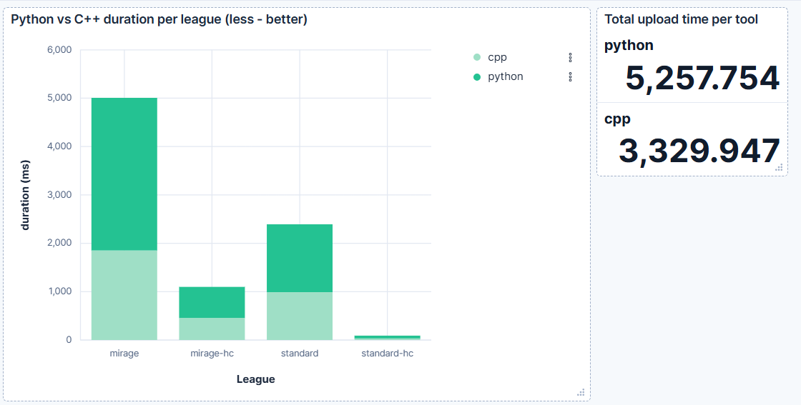
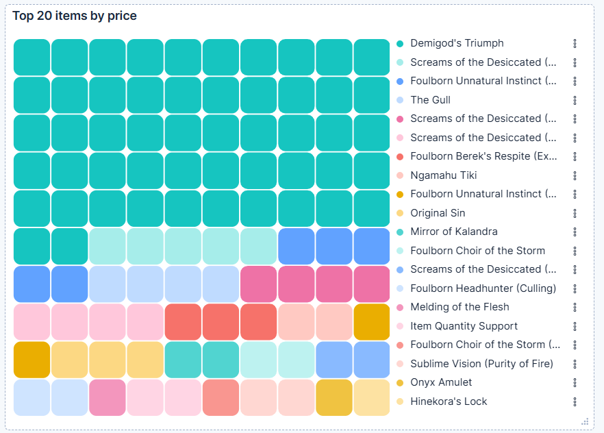
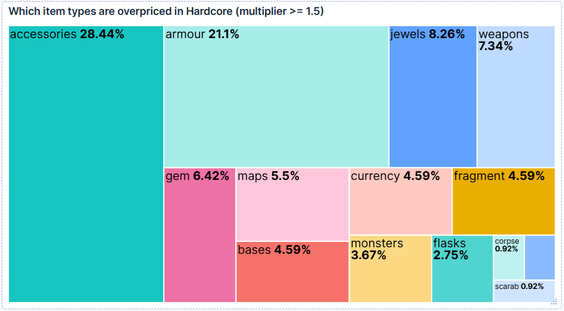

# Small weekend project (Kibana & Elasticsearch)

[poe.watch](https://api.poe.watch/) market snapshots into **Elasticsearch**, explore them in **Kibana**, and compare bulk-ingest speed between **Python** and **C++**.

Stack: Elasticsearch **9.3.4**, Kibana **9.3.4**, Python **3.12** (Elasticsearch client + `requests`), C++ **17** (**simdjson** + **cpp-httplib**, CMake **FetchContent**).

---

## What it does

1. **Download** compact market JSON for four leagues (Mirage SC/HC, Standard SC/HC) into `data/raw/`.
2. **Write** `data/raw/manifest.json` describing those files (single source of truth for uploaders).
3. **Apply** two Elasticsearch **index templates**:
   - `poe-data-*` — strict mapping for market documents.
   - `poe-bench` — one row per ingest run (tool, league, timing).
4. **Bulk index** the same data with either **Python** or **C++**, stamping `@timestamp`, `league`, `hardcore`, and `ingest_metadata.language`.
5. **Visualize** in Kibana (bench comparison + optional cross-league scarcity analysis via Transform).

---

## Repository layout

```
docker/
  docker-compose.yml   # ES + Kibana + one-shot setup-index container
  Dockerfile           # Python image for setup-index (uv + deps)
python/
  download_data.py     # Fetches JSON + writes manifest.json
  bulk_upload.py       # Reads manifest, streams bulk to ES, writes bench rows
  setup_index.py       # PUT index templates (poe-data + poe-bench)
  mappings/
    poe_index_v1.json  # Template for poe-data-*
    poe_bench_v1.json  # Template for poe-bench
cpp/                   # Done with the help of AI
  CMakeLists.txt
  src/main.cpp         # C++ bulk uploader + bench rows
data/raw/              # Snapshots + manifest (large JSON usually gitignored)
PLAN.md                # Project checklist (optional)
```

`.gitignore` ignores `data/` except `data/raw/manifest.json`, so snapshot files stay local unless you commit them on purpose.

---

## 1. Start Elasticsearch & Kibana

The Compose file lives under `docker/`. From the **repository root**:

```bash
docker compose -f docker/docker-compose.yml up -d --build
```

What starts:

| Service           | Role |
|-------------------|------|
| `elasticsearch`   | port **9200** |
| `setup-index`     | runs `python/setup_index.py`, applies mappings |
| `kibana`          | UI on **5601** |


---

## 2. Fetch data & manifest

From repo root (with `.venv` activated if you use uv):

```bash
uv sync
uv run python/download_data.py
```

This writes:

- `data/raw/market_snapshot_*.json`
- `data/raw/manifest.json` (`snapshot_at`, `source`, `datasets[]` with `league_id`, `hardcore`, relative `file`)

Edit leagues in `python/download_data.py` → `LEAGUES` if you need other ladders.

---

## 3. Bulk upload — Python

```bash
uv run python/bulk_upload.py
```

Writes to `poe-data-{league_id}` and appends rows to `poe-bench` with `tool: python`.

---

## 4. Bulk upload — C++

Build:

```bash
cmake -B cpp/build -S cpp
cmake --build cpp/build -j
```

Run:

```bash
./cpp/build/bulk_upload
```

---

## Some visualisations

**End-to-end bulk ingest is dominated by Elasticsearch** The files are too small (overall 40 MB). But anyway parsing in C++ is much faster then Python in isolation, but measured by full upload.



Since HC and SC prices are in different documents, we use a transform to merge them into one document 

```json
PUT _transform/poe_scarcity
{
  "source": {
    "index": ["poe-data-*"],
    "query": { "term": { "lowConfidence": false } }
  },
  "pivot": {
    "group_by": {
      "item_name": { "terms": { "field": "name" } },
      "item_category": { "terms": { "field": "category" } }
    },
    "aggregations": {
      "sc_price": {
        "filter": { "term": { "league": "mirage" } },
        "aggs": { "avg_price": { "avg": { "field": "mean" } } }
      },
      "hc_price": {
        "filter": { "term": { "league": "mirage-hc" } },
        "aggs": { "avg_price": { "avg": { "field": "mean" } } }
      },
      "scarcity_multiplier": {
        "bucket_script": {
          "buckets_path": {
            "hc": "hc_price > avg_price",
            "sc": "sc_price > avg_price"
          },
          "script": "params.hc / params.sc"
        }
      }
    }
  },
  "dest": { "index": "poe-scarcity-results" }
}
```


---

## Design decisions

| Decision | Rationale |
|----------|-----------|
| **Index templates** instead of hand-creating indices | `poe-data-*` indices appear on first write; mapping is consistent. |
| **`dynamic: strict`** on market docs | Wrong or new fields fail so we can catch them instead of silently drifting mappings. |
| **`poe-bench` index** | Stores per-run timings for Kibana without mixing into market docs. |

---


## License / attribution

Game data from Path of Exile is subject to Grinding Gear Games' terms.  
Market API: **poe.watch** 
